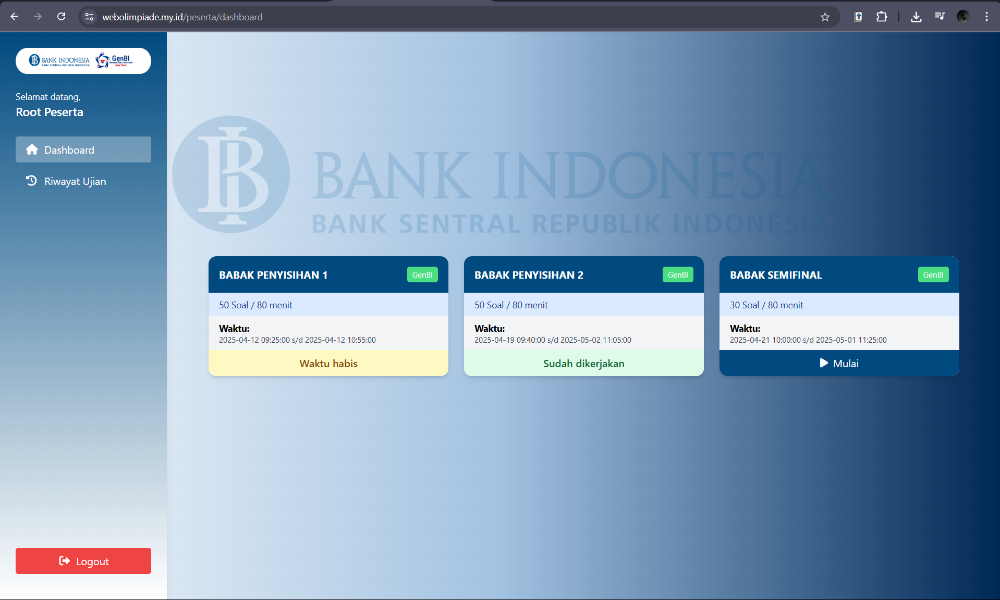
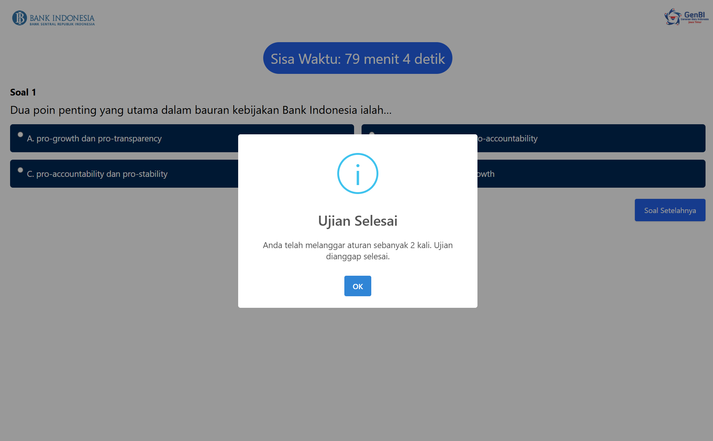

<h1 align="center">
    
</h1>

<h2 align="center">Admin Dashboard – Real-time Monitoring</h2>
<h3 align="center">The admin dashboard displays exam statistics per round, visualized with charts indicating how many participants are safe, warned once, or disqualified due to two system alerts.</h3>

<h2 align="center">Admin – Exam Result Analytics</h2>
<h3 align="center">Scores are automatically sorted from highest to lowest, with tie-breaking based on completion time. For essay-based rounds, admins can export individual answers. Full data export is supported.</h3>

<h2 align="center">Admin – Live Proctoring Table</h2>
<h3 align="center">The admin panel includes a live monitoring table that displays participant status in real time. Each user is flagged with a color: green for safe, yellow for first warning, and red for disqualification. This feature helps maintain exam integrity by detecting suspicious actions like exiting fullscreen or switching tabs.</h3>

<h2 align="center">Admin – Participant Management</h2>
<h3 align="center">Admins can view and edit participant details, including usernames and passwords, through a centralized participant list feature.</h3>

<h2 align="center">Admin – Manual Registration</h2>
<h3 align="center">Admins can register new participants directly into the system</h3>

<h2 align="center">Participant Dashboard Overview</h2>
<h3 align="center">Participants have a personalized dashboard showing all exam rounds and their status.</h3>

<h2 align="center">Participant – Exam History & Warnings</h2>
<h3 align="center">Participants can track their completed exams, see how many questions were answered, their completion duration, and whether they were flagged or disqualified.</h3>

<h2 align="center">Participant – Controlled Exam Flow</h2>
<h3 align="center">Participants enter fullscreen mode when starting an exam. Questions are answered sequentially — no going back, as per committee request.</h3>

<h2 align="center">Anti-Cheating System</h2>
<h3 align="center">The system detects when participants exit fullscreen, resize the browser, or use Alt+Tab.

1st warning = Yellow alert in admin view

2nd warning = Forced submission & red alert (disqualification)</h3>

<h2 align="center">Essay Question Support</h2>
<h3 align="center">Participants can answer descriptive questions, and responses are fully exportable from the admin panel for detailed review.</h3>

